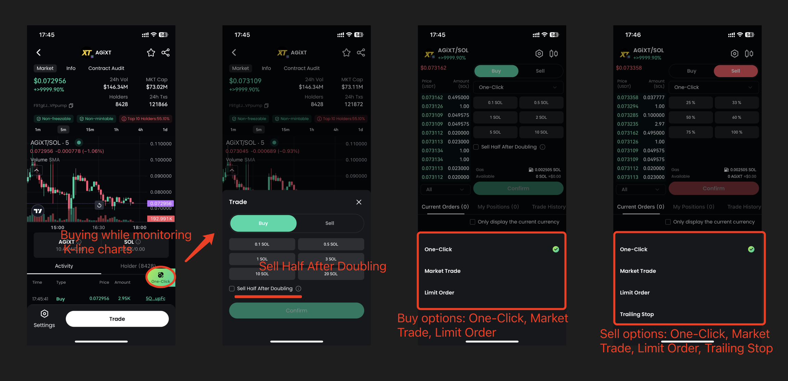

# Quick Start

### 1. Homepage

<figure><figcaption></figcaption></figure>

* Users can search by copying the CA or token name
* The carousel at the top can be clicked for detailed content
* The bottom section shows the top trending tokens based on price changes over different time periods

### 2. Trading

<figure><figcaption></figcaption></figure>

* Click a token, you will be directed to the token detail page
  * The top section displays four key parameters: 24h trading volume, market cap, holders, and 24h transaction volume
  * The middle section shows K-line charts for different time periods
  * The bottom section displays all real-time transaction records and the token holder distribution data
* Users can click "One-Click" on this page to purchase directly from the token detail page. They can monitor the K-line chart while buying and also choose the "Sell half after doubling " option
* For buying a token, three modes are supported: One-Click, Market Order, and Limit Order
* For selling a token, four modes are available: One-Click, Market Order, Limit Order, and Trailing Stop

### 3. Meme Information

<figure><figcaption></figcaption></figure>

* We offer two types of AI Agents: An Aggressive version and A Conservative version. The aggressive AI will recommend tokens with higher potential returns, while the conservative AI focuses on protecting your principal by recommending tokens with the potential for moderate growth
* The PumpX Information feed aggregates popular crypto-related posts from X, showcasing tokens and related information within those posts

