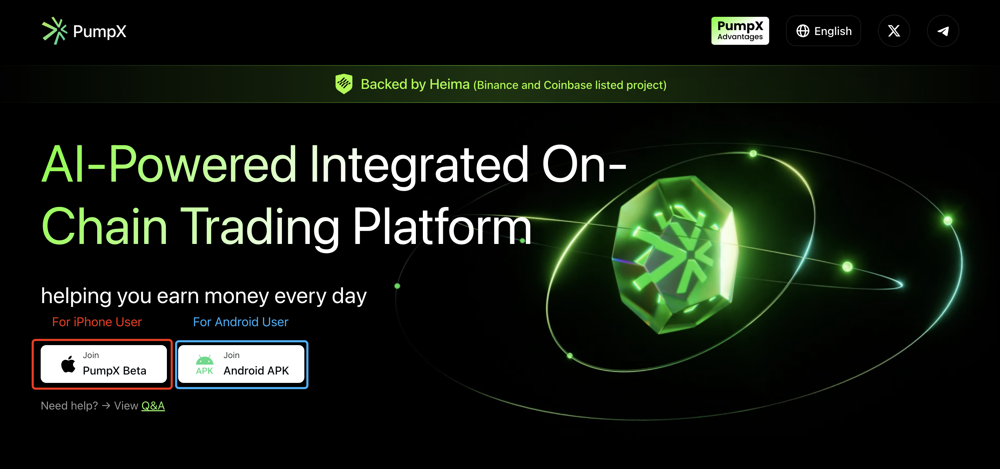

# Account Deletion Policy

At PumpX, we prioritize the privacy and security of our users. This document outlines the procedures and timelines related to the deletion of user accounts and associated data.

#### 1. **Account Deletion Request**

Users have the ability to delete their PumpX account at any time. To initiate the deletion process, users must submit a request via the platform interface. Once the request is submitted, we will proceed with the account deletion.PumpX is a non-custodial platform and does not require KYC (Know Your Customer) verification. As such, users are solely responsible for managing their accounts and associated private keys.

#### **2. Data Deletion Scope**

Upon account deletion, the following user data will be permanently erased:

* Account information (username, email, password,and other identifying information)
* Transaction history
* User preferences
* Any other personal data stored in our database related to the account

Please note that because PumpX does not require Know Your Customer (KYC) verification, no personally identifiable information (PII) beyond what is collected through our platform will be retained or stored.

#### **3. Legal and Compliance Obligations**

In certain situations, data retention may be required by law for regulatory purposes. If PumpX is obligated to retain data to comply with legal or regulatory requirements, we will retain the necessary data for the specified duration before it is permanently deleted.

#### **4. Data Security:**

Since PumpX does not collect or store any user data, there is no centralized repository of information that could be vulnerable to breaches or unauthorized access. Users are responsible for safeguarding their own private keys and managing their digital assets securely.

#### 5. **Final Considerations**

* Once the account and data are deleted, they cannot be recovered.
* We encourage users to back up any necessary information before proceeding with account deletion.

By using the PumpX platform, you acknowledge and agree to the terms of this account deletion and data retention policy.

#### **6. Timeline for Deletion**

Upon receiving a valid account deletion request, we will proceed with the following timeline:

* **Account Deletion Process Initiation:** We will initiate the deletion process within **7 business days** of receiving the request.
* **Data Deletion:** All personal data associated with the account, including transaction history, account details, and any other identifiable information, will be deleted within **30 days** of the request.

Please note that certain data may be retained for a longer period if required by applicable laws or for legitimate business purposes, such as complying with anti-money laundering (AML). This retention will only apply to the extent necessary and will be limited to the minimum required by law.

#### **7. User Rights**

Users have the right to:

* **Request Deletion:** Users can request account deletion at any time by contacting us.
* **Data Access:** Users may request access to their personal data before deletion by contacting our support team.
* **Rectification:** Users can request corrections to their personal data if any information is inaccurate or incomplete.

#### **8. Policy Updates**

PumpX reserves the right to amend this policy. Continued use of the platform constitutes acceptance of revised terms.

Contact Us: If you have any questions or concerns about this Policy or our data deletion practices, please contact us here: [https://x.com/pumpx\_ai](https://x.com/pumpx_ai).&#x20;

## **Account Cancellation Process**

1. **Access Settings:** Click on the bottom right corner to enter “Settings.”
2. **Select Delete Account:** Choose the “Delete Account” option.

<figure><figcaption></figcaption></figure>

3. Confirm Deletion: Click “Confirm” to proceed with account deletion.

<figure><figcaption></figcaption></figure>
